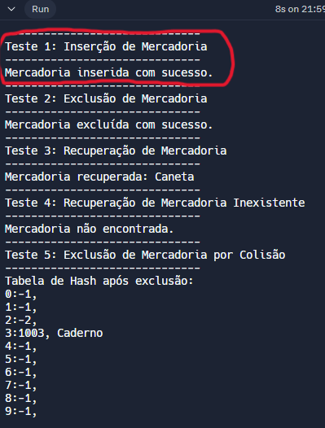
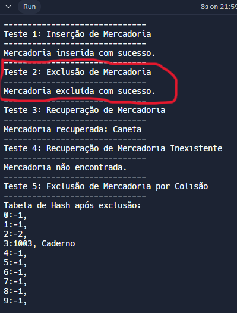
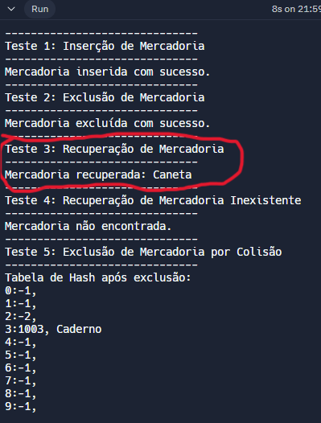
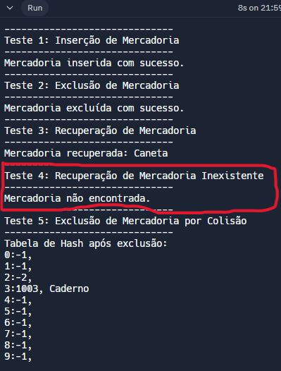
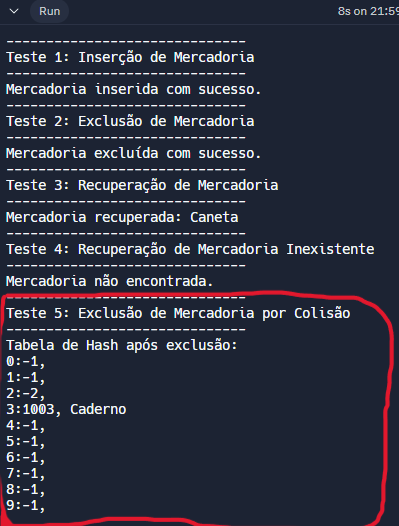

# Resultados dos Testes da Tabela de Hash de Mercadorias

### 🫨Casos de Teste🫨

1. **Inserção de Mercadoria:**
   - Verifica se é possível inserir uma mercadoria na tabela de hash.
   - Entrada: ID e nome da mercadoria.
   - Saída Esperada: Confirmação de que a mercadoria foi inserida com sucesso.

2. **Exclusão de Mercadoria:**
   - Verifica se é possível excluir uma mercadoria da tabela de hash.
   - Entrada: ID da mercadoria que vai ser excluída.
   - Saída Esperada: Confirmação de que a mercadoria foi excluída com sucesso.

3. **Recuperação de Mercadoria:**
   - Verifica se é possível recuperar uma mercadoria da tabela de hash.
   - Entrada: ID da mercadoria que precisa ser recuperada.
   - Saída Esperada: Nome da mercadoria recuperada.

4. **Recuperação de Mercadoria Inexistente:**
   - Verifica se é possível recuperar uma mercadoria que não está na tabela de hash.
   - Entrada: ID de uma mercadoria que não existe na tabela.
   - Saída Esperada: Confirmação de que a mercadoria não foi encontrada (já que ela não existe).

5. **Exclusão de Mercadoria por Colisão:**
   - Verifica se é possível excluir uma mercadoria que está colidindo com outra na tabela de hash.
   - Entrada: ID de uma mercadoria que está em colisão.
   - Saída Esperada: Confirmação de que a mercadoria foi excluída com sucesso.

 

## 🤩Resultados dos Testes🤩

- Teste 1: Inserção de Mercadoria
  - Resultado: Sucesso
  - Descrição: Uma mercadoria foi inserida com sucesso na tabela de hash.

Figura 1 - Resultado do teste 1

Fonte: Captura de tela produzida pela autora (2024)

 
 

- Teste 2: Exclusão de Mercadoria
  - Resultado: Sucesso
  - Descrição: Uma mercadoria foi excluída com sucesso da tabela de hash.

Figura 2 - Resultado do teste 2

Fonte: Captura de tela produzida pela autora (2024)

 
 

- Teste 3: Recuperação de Mercadoria
  - Resultado: Sucesso
  - Descrição: Uma mercadoria foi recuperada corretamente da tabela de hash.

Figura 3 - Resultado do teste 3

Fonte: Captura de tela produzida pela autora (2024)

 
 

- Teste 4: Recuperação de Mercadoria Inexistente
  - Resultado: Sucesso
  - Descrição: Uma tentativa de recuperar uma mercadoria inexistente não encontrou a mercadoria na tabela de hash.

Figura 4 - Resultado do teste 4

Fonte: Captura de tela produzida pela autora (2024)

 
 

- Teste 5: Exclusão de Mercadoria por Colisão
  - Resultado: Sucesso
  - Descrição: Uma mercadoria em uma posição com colisão foi excluída com sucesso da tabela de hash.

Figura 5 - Resultado do teste 5

Fonte: Captura de tela produzida pela autora (2024)

 
 

## 😭Problemas😭

- Restou somente uma mercadoria na tabela, e eu não sei como consertar isso. Não tenho ideia do porquê do resto ter simplesmente sumido.
